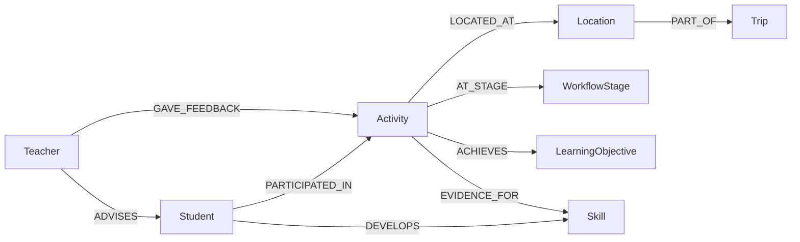

# Task 3: Graph Database Modeling

## Why a graph model?

The Experiential Learning Platform stores operational data in **MySQL** (`members`, `board_cards`, `learning_objectives`, …). That answers *what* was recorded. Experiential learning is also about **context and paths**: who visited where, which activity achieved which learning objective, which skill was evidenced by which card, and how teachers advised students through workflow stages.

A property graph (**Neo4j 5**) makes paths such as *Student → Activity → Location → LearningObjective* and *Student → DEVELOPS → Skill* first-class. That supports insight queries and **Graph RAG** retrieval that are awkward in flat SQL joins.

This project **deploys Neo4j via Docker Compose** and keeps the graph in sync with MySQL through `backend/src/graph-sync.js`.

---

## Nodes vs relationships

| Graph element | Examples | What it captures |
|---------------|----------|------------------|
| **Node** | `Student`, `Teacher`, `Activity`, `Location`, `Trip` | People, field-trip activities, heritage sites, route context |
| **Node** | `Skill`, `LearningObjective`, `WorkflowStage`, `Media`, `Class` | Reusable curriculum and process dimensions |
| **Relationship** | `PARTICIPATED_IN`, `LOCATED_AT`, `VISITED`, `ACHIEVES` | Who did what, where, and which curriculum goals were met |
| **Relationship** | `DEVELOPS`, `EVIDENCE_FOR`, `ADVISES`, `GAVE_FEEDBACK` | Skill growth, evidence links, teaching relationships |
| **Relationship** | `AT_STAGE`, `HAS_STAGE`, `HAS_MEDIA`, `PART_OF`, `ENROLLED_IN` | Kanban workflow, photos, trip hierarchy, class membership |

**Rule of thumb:** if you would `JOIN` two tables to answer “how are these connected?”, that connection is usually an **edge**. If the entity has its own lifecycle and attributes, it is usually a **node**.

---

## Schema diagram (Mermaid)

GitHub renders the diagram below directly in this markdown file.

```mermaid
erDiagram
    Student ||--o{ PARTICIPATED_IN : performs
    Activity ||--o{ PARTICIPATED_IN : ""
    Student ||--o{ VISITED : ""
    Location ||--o{ VISITED : ""
    Activity ||--o| LOCATED_AT : at
    Location ||--o| LOCATED_AT : ""
    Activity ||--o| AT_STAGE : in
    WorkflowStage ||--o| AT_STAGE : ""
    Student ||--o{ HAS_STAGE : owns
    WorkflowStage ||--o{ HAS_STAGE : ""
    Activity ||--o{ ACHIEVES : meets
    LearningObjective ||--o{ ACHIEVES : ""
    Student ||--o{ DEVELOPS : ""
    Skill ||--o{ DEVELOPS : ""
    Activity ||--o{ EVIDENCE_FOR : ""
    Skill ||--o{ EVIDENCE_FOR : ""
    Teacher ||--o{ ADVISES : ""
    Student ||--o{ ADVISES : ""
    Teacher ||--o{ GAVE_FEEDBACK : ""
    Activity ||--o{ GAVE_FEEDBACK : ""
    Activity ||--o{ HAS_MEDIA : ""
    Media ||--o{ HAS_MEDIA : ""
    Location ||--o{ PART_OF : ""
    Trip ||--o{ PART_OF : ""
    Student ||--o{ ENROLLED_IN : ""
    Class ||--o{ ENROLLED_IN : ""

    Student {
        string mysqlId
        string name
        string email
        string className
    }
    Teacher {
        string mysqlId
        string name
        string email
    }
    Activity {
        string mysqlId
        string title
        string description
        string recordType
        string activityDate
    }
    Location {
        string checkpointId
        string nameChi
        string nameEng
        float lat
        float lng
    }
    Trip {
        string name
        string title
    }
    Skill {
        string mysqlId
        string name
    }
    LearningObjective {
        string mysqlId
        string objectiveCode
        string content
        string category
    }
    WorkflowStage {
        string mysqlId
        string stageKey
        string title
    }
```

### Learning journey path (simplified)



---

## How to view the schema visually

### 1. Neo4j Browser (recommended for demos)

1. Start the stack: `docker compose up -d`
2. Open **http://localhost:7474**
3. Connect using the Bolt URI for your environment (see `.env` / deployment config) and the credentials set in `NEO4J_USER` and `NEO4J_PASSWORD` (never commit these values).

> Use a strong, unique password before exposing port 7474 on a public subdomain. See `.env.example` for variable names.

**Explore all node labels and relationship types:**

```cypher
CALL db.labels() YIELD label RETURN label ORDER BY label;
```

```cypher
CALL db.relationshipTypes() YIELD relationshipType RETURN relationshipType ORDER BY relationshipType;
```

**Render an interactive subgraph** (drag nodes in the Browser canvas):

```cypher
MATCH (s:Student)-[r]->(n)
RETURN s, r, n
LIMIT 50;
```

**Full meta-graph** (requires APOC — already enabled in `docker-compose.yml`):

```cypher
CALL apoc.meta.graph() YIELD nodes, relationships
RETURN nodes, relationships;
```

### 2. Markdown diagrams (this file)

The Mermaid blocks above render on GitHub and in VS Code markdown preview. Use them in your Task 3 submission as the required **diagram inside the repo**.

### 3. Schema inventory query

Count nodes and edges currently synced from your running app:

```cypher
MATCH (n)
RETURN labels(n)[0] AS label, count(*) AS count
ORDER BY count DESC;
```

```cypher
MATCH ()-[r]->()
RETURN type(r) AS relationship, count(*) AS count
ORDER BY count DESC;
```

---

## Example Cypher queries

These match the **actual** schema in `graph-sync.js` and `graph-rag.js`.

### 1. Students who developed a skill at a specific location

Find students whose confirmed skill development is evidenced by an activity at 天后宮:

```cypher
MATCH (s:Student)-[:PARTICIPATED_IN]->(a:Activity)-[:LOCATED_AT]->(l:Location)
WHERE l.nameChi CONTAINS '天后宮'
MATCH (s)-[d:DEVELOPS]->(sk:Skill)
WHERE coalesce(d.status, 'confirmed') = 'confirmed'
  AND (d.evidenceActivityId = a.mysqlId OR d.evidenceActivityId IS NULL)
RETURN s.name AS student,
       sk.name AS skill,
       d.level AS level,
       a.title AS activity,
       l.nameChi AS location
ORDER BY s.name, sk.name;
```

### 2. Cross-student insight: locations visited by a teacher's class

```cypher
MATCH (t:Teacher {mysqlId: $teacherMysqlId})-[:ADVISES]->(s:Student)-[:VISITED]->(l:Location)
RETURN l.nameChi AS location,
       count(DISTINCT s) AS studentCount,
       collect(DISTINCT s.name) AS students
ORDER BY studentCount DESC, location;
```

Replace `$teacherMysqlId` with the teacher's MySQL id (e.g. `"2"`).

### 3. Activities linked to learning objectives (curriculum alignment)

```cypher
MATCH (s:Student {mysqlId: $studentMysqlId})-[:PARTICIPATED_IN]->(a:Activity)-[:ACHIEVES]->(lo:LearningObjective)
RETURN a.title AS activity,
       a.recordType AS recordType,
       lo.objectiveCode AS objectiveCode,
       lo.category AS category,
       lo.content AS objectiveContent
ORDER BY a.title, lo.objectiveCode
LIMIT 30;
```

### 4. Post-trip reflection activities

```cypher
MATCH (s:Student)-[:PARTICIPATED_IN]->(a:Activity)-[:AT_STAGE]->(w:WorkflowStage)
WHERE w.stageKey = 'post_trip'
OPTIONAL MATCH (a)-[:ACHIEVES]->(lo:LearningObjective)
RETURN s.name AS student,
       a.title AS activity,
       collect(DISTINCT lo.objectiveCode) AS objectives
ORDER BY student, activity;
```

---

## MySQL → Neo4j mapping

| MySQL | Graph |
|-------|-------|
| `members` (student) | `(:Student {mysqlId, name, email, className, …})` |
| `members` (teacher) | `(:Teacher {mysqlId, name, email})` |
| `members.class_name` | `(:Student)-[:ENROLLED_IN]->(:Class {name})` |
| `members.advisor_teacher_id` | `(:Teacher)-[:ADVISES]->(:Student)` |
| `board_columns` | `(:WorkflowStage)` + `(:Student)-[:HAS_STAGE]->(w)` |
| `board_cards` | `(:Activity)` + `(:Student)-[:PARTICIPATED_IN]->(a)` |
| `board_cards` column | `(:Activity)-[:AT_STAGE]->(:WorkflowStage)` |
| `board_cards.checkpoint_id` | `(:Activity)-[:LOCATED_AT]->(:Location)` + `(:Student)-[:VISITED]->(l)` |
| `board_cards.feedback` | `(:Teacher)-[:GAVE_FEEDBACK {text}]->(:Activity)` |
| `card_images` | `(:Media)` + `(:Activity)-[:HAS_MEDIA]->(m)` |
| `learning_objectives` | `(:LearningObjective)` |
| `card_learning_objectives` | `(:Activity)-[:ACHIEVES]->(:LearningObjective)` |
| `skills` | `(:Skill)` |
| `student_skills` (confirmed) | `(:Student)-[:DEVELOPS {level, status, source, …}]->(:Skill)` |
| `student_skills.card_id` | `(:Activity)-[:EVIDENCE_FOR]->(:Skill)` |
| `CHECKPOINTS` constants | `(:Location)-[:PART_OF]->(:Trip {name: 'lung_yeuk_tau'})` |

### Sync triggers

| Event | Sync function |
|-------|---------------|
| Server startup | `fullGraphResync()` — rebuilds entire graph |
| Card create/update/delete | `syncCardGraph()` / `deleteCardGraph()` |
| Skill confirm/reject | `syncStudentSkillGraph()` / `deleteStudentSkillGraph()` |
| Learning objective CRUD | `syncLearningObjectiveGraph()` |

Implementation: `backend/src/graph-sync.js`, orchestrated from `backend/src/index.js`.

---

## Deployment

Neo4j runs as a Docker Compose service:

| Service | Host port | Purpose |
|---------|-----------|---------|
| `neo4j` | 7474 (HTTP Browser), 7687 (Bolt) | Graph storage & exploration |
| `backend` | 4000 | Sync + Graph RAG API |
| `db` | internal | MySQL operational store |

On first backend startup:

1. `initGraphSchema()` — constraints + seed `Trip` and `Location` nodes
2. `importAllLearningContent()` — student dataset + curriculum
3. `fullGraphResync()` — mirror MySQL into Neo4j
4. Objective auto-link + skill inference — enrich `ACHIEVES` and `DEVELOPS`
