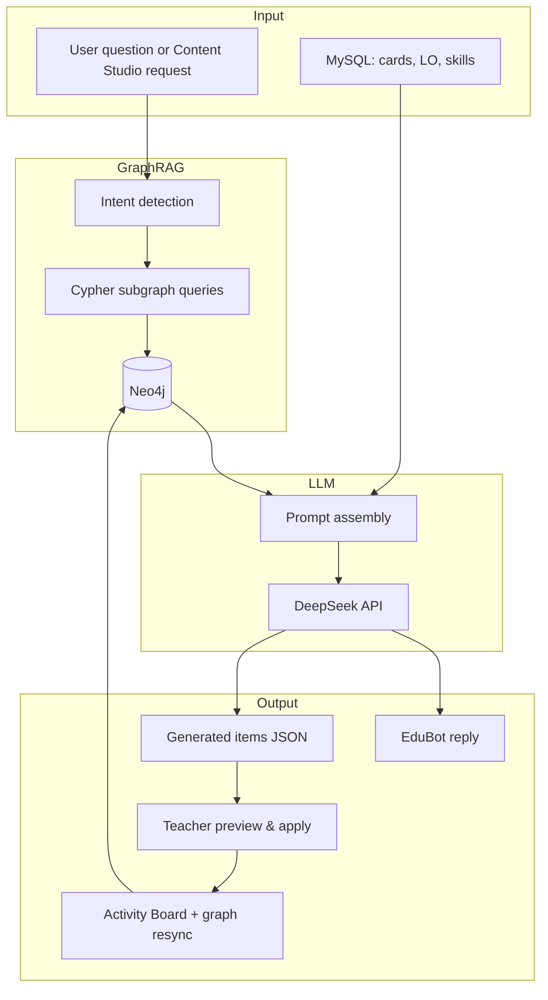

# GraphDB-RAG AI Proposal

## Purpose

Leverage the **Neo4j learning knowledge graph** together with **curriculum data** and **student experiential records** to:

1. Power **grounded AI Q&A** (EduBot) for students and teachers
2. **Semi-automatically generate** reflection prompts, follow-up activities, and mini-assessments (Content Studio)

This is **Graph-augmented RAG** at inference time: structured subgraph retrieval via Cypher, then LLM generation — not a separate fine-tuned model.

---

## Data sources

| Source | Storage | Graph representation | Used for |
|--------|---------|----------------------|----------|
| **(1) Curriculum data** | MySQL `learning_objectives` | `(:LearningObjective)` + `(:Activity)-[:ACHIEVES]->(lo)` | Aligning activities and assessments to P4 humanities/science objectives |
| **(2) Teaching / learning resources** | Curriculum xlsx + activity card text | Objectives as nodes; activity descriptions as evidence on `Activity` nodes | Context for question generation (no separate textbook DB in this phase) |
| **(3) Student data** | MySQL board + dataset import | `Student`, `Activity`, `Location`, `Skill`, `WorkflowStage`, `DEVELOPS`, `VISITED` | Personalised RAG and per-student content generation |

Dataset import (`learning_content_dataset/`) provides:

- `MapLocation.xlsx` → Actual Trip / Post Trip activity cards
- `FiveSense.xlsx` → five-sense reflection content
- `EDB_P4_人文科學課程_curriculum_總表.xlsx` → learning objectives

---

## Architecture overview



---

## Component 1: EduBot Graph RAG (`graph-rag.js`)

### Flow

1. User sends a message via `POST /api/ai/chat`
2. `detectIntents(question)` maps keywords to intents: `locations`, `objectives`, `skills`, `reflection`, `feedback`, `progress`, `compare`
3. Role-based Cypher queries fetch relevant subgraph rows:
   - **Student**: own activities, locations, objectives, confirmed skills, reflections
   - **Teacher**: all assigned students' activities, locations, objectives, skills
4. Results are formatted as plain-text sections and injected as a **system message** before the LLM call
5. DeepSeek generates a grounded reply using graph context + board snapshot

### Example teacher questions that trigger graph retrieval

| Question (ZH/EN) | Intents | Graph sections used |
|------------------|---------|---------------------|
| 邊個學生去過天后宮？ | locations | 學生參觀地點 |
| 陳翰霖有咩技能？ | skills | 已確認技能發展 |
| 誰還沒完成反思？ | reflection, progress | Post Trip 反思活動 |
| Compare class progress | compare, overview | 學生活動概覽 |

### API

| Method | Path | Description |
|--------|------|-------------|
| POST | `/api/ai/chat` | Chat with Graph RAG context |
| GET | `/api/ai/chat/history` | Persisted chat history |

---

## Component 2: Content Studio semi-auto generation (`content-generator.js`)

### Flow

1. Teacher selects **student** + **activity card** in Content Studio UI
2. `GET /api/content-studio/context` loads card, linked objectives, confirmed skills
3. `POST /api/ai/generate-content` runs:
   - `buildStudentGraphRagContext(studentId, question)` — focused Neo4j retrieval
   - Card + curriculum text assembly
   - DeepSeek with `response_format: json_object` → structured items
4. Teacher **previews**, toggles checkboxes, then `POST /api/ai/apply-generated-content`
5. Applied content updates MySQL → `syncCardGraph()` → Neo4j stays current

### Generation types

| Type | Output | Apply behaviour |
|------|--------|-----------------|
| `reflection` | Post-trip reflection prompts | Append to existing card description |
| `followup` | Extension activity suggestions | Create new card in **Pretrip** (`source: ai_generated`) |
| `assessment` | MCQ + short-answer items | Create new card in **Pretrip** or **Post Trip** (`record_type: assessment`) |

### Semi-auto principle

```
AI generates  →  Teacher reviews & selects  →  One-click apply  →  Graph resync
```

The teacher always confirms before content reaches the student's board. This satisfies **semi-auto generating learning content and assessment**.

### APIs

| Method | Path | Description |
|--------|------|-------------|
| GET | `/api/content-studio/context` | Card + LO + skill context |
| POST | `/api/ai/generate-content` | Graph RAG + LLM generation |
| POST | `/api/ai/apply-generated-content` | Apply selected items to board |

---

## Prompt design

### Graph context block (shared pattern)

```
以下資料來自 Neo4j 學習知識圖譜（Graph RAG），請優先根據這些節點與關係回答：
[活動與階段概覽]
[參觀地點與路線]
[活動連結的學習重點]
[已確認技能發展]
...
```

### Content generation JSON schema

```json
{
  "summary": "Brief rationale for the generated set",
  "items": [
    {
      "title": "Item title",
      "content": "Full text",
      "kind": "reflection_question | followup_activity | mcq | short_answer",
      "options": ["A...", "B..."],
      "answerHint": "Marking guidance"
    }
  ]
}
```

---

## Skill inference integration

After cards are created or updated (including AI-applied content):

1. `autoLinkCardObjectives()` — rule-based LO matching from location/keywords
2. `inferStudentSkillsForCard()` — rule-based skill suggestions
3. `syncCardGraph()` + `syncStudentSkillGraph()` — graph reflects new `ACHIEVES` and `DEVELOPS` edges

Teachers confirm suggested skills on the **Skills** page; only `confirmed` skills appear in Graph RAG queries.

---

## Why graph RAG instead of vector-only RAG?

| Approach | Strength | Used here |
|----------|----------|-----------|
| **Vector RAG** | Semantic similarity over long documents | Future phase (textbook PDF chunks) |
| **Graph RAG** | Exact relational paths: student × location × objective × skill | **Primary** — matches experiential learning structure |
| **Hybrid** | Both | Planned extension |

Graph RAG excels when questions are relational:

- “Which students visited 老圍 **and** achieved objective 4.3.2-1?”
- “What skills did 陳翰霖 develop with evidence at 天后宮?”

Cypher traverses explicit edges; vector search alone would not preserve these joins reliably.

---

## File reference

| File | Role |
|------|------|
| `backend/src/graph-sync.js` | MySQL → Neo4j sync |
| `backend/src/graph-rag.js` | Intent-based Cypher retrieval for chat |
| `backend/src/content-generator.js` | Semi-auto content generation |
| `backend/src/objective-matching.js` | Auto-link LO to cards |
| `backend/src/skill-inference.js` | Rule-based skill suggestions |
| `frontend/components/teacher/content-studio-page.tsx` | Content Studio UI |
| `frontend/components/chat/ai-chatbot.tsx` | EduBot UI |
